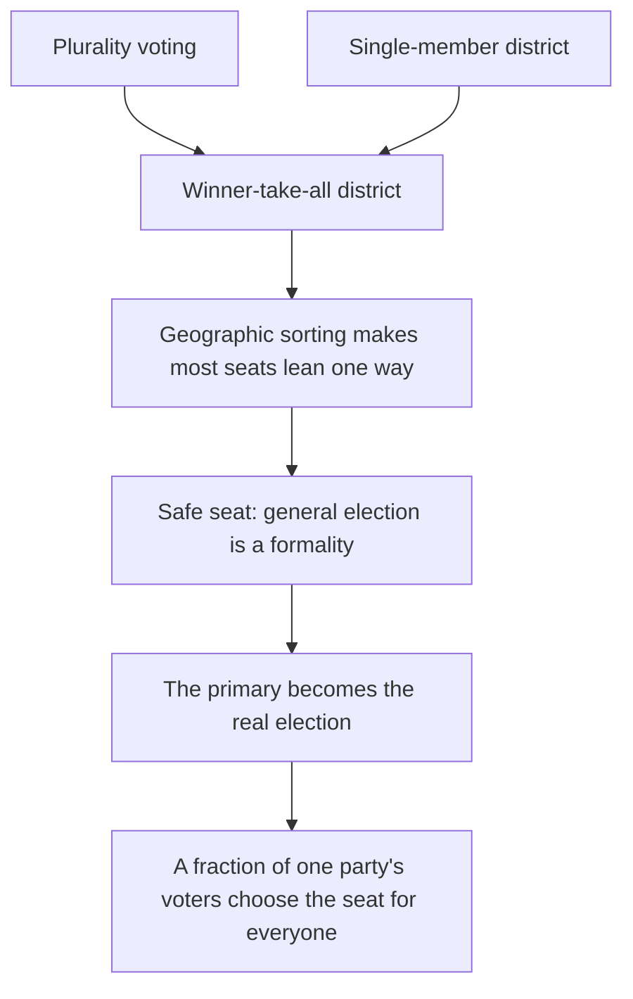
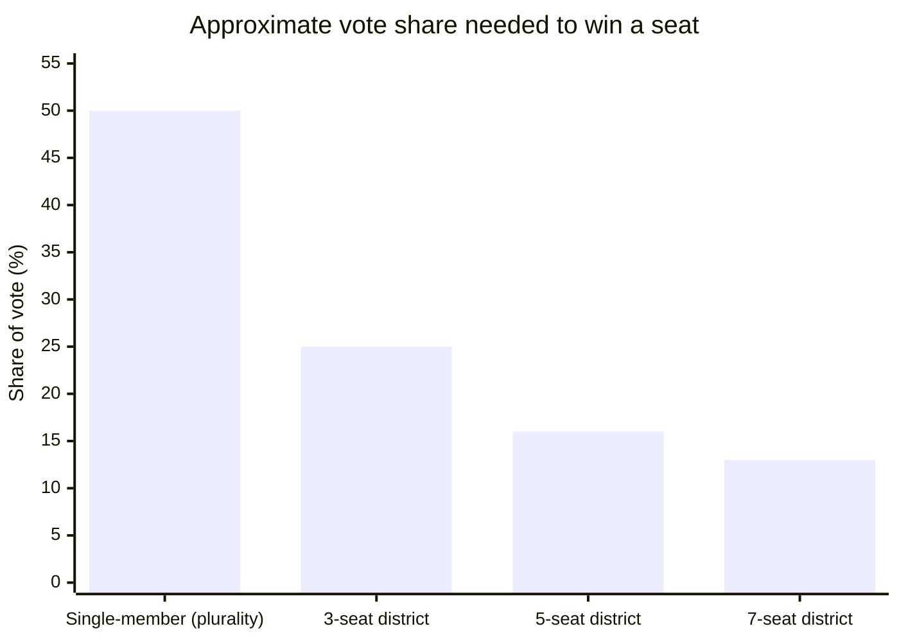

# No Primaries? No Problem!

## A Position Paper of the Congressional Elections Modernization Act (CEMA)

*Prepared by Albert Ramos for The American Policy Architecture Institute*

---

The Congressional Elections Modernization Act (CEMA) removes the state-administered party primary from congressional elections. To many readers that will sound like the radical move -- the primary is so familiar a fixture of American politics that removing it can seem like removing elections themselves. This paper explains why the opposite is true: why removing the primary, inside the system CEMA builds, is a benefit and not a loss. The case is best made from the ground up -- starting with what a primary actually is.

## What a Primary Is

Start with the basic case, the one most voters know firsthand. A congressional seat is filled in a single-member district: one seat, one winner. On Election Day in November, each party that wants the seat puts forward one candidate. Voters expect this. The ballot offers them a Democrat, a Republican, perhaps a third-party or independent name -- one standard-bearer per party, lined up against the others.

But a party rarely has just one person who wants to run. So the party needs a way to settle, in advance, which of its hopefuls will be the one to carry its banner in November. That is the primary. It is the contest held before the general election to winnow each party's field down to a single nominee. When voters go to the polls for a primary, this is what they are doing: choosing, from within a party, who that party will send forward.

There are several kinds of primaries. In a *closed* primary, only registered party members may vote; in an *open* primary, any voter may take part; *semi-closed* systems fall in between. A few states have moved away from party nomination altogether -- *top-two* systems advance the two highest finishers regardless of party, and Alaska's *top-four* system sends four candidates to a ranked general election. The variations are real, but they should not distract from the common purpose. Whatever the form, the primary does one job: it reduces a crowded field to the names that will appear on the November ballot. It is, at bottom, a winnowing election.

Two features of this arrangement matter especially. The primary is run by the state and paid for by the public. And it is comparatively unusual: in most established democracies, parties choose their candidates internally -- through members, delegates, or committees -- not through a public election the government administers. The American habit of having the state run and fund a party's nominating contest is close to a national peculiarity, and it is the root of the difficulties that follow.

## The Architecture of Distortion

The primary, by itself, is not the disease. A party holding a nominating contest is ordinary associational function. What turns that function toxic is the architecture surrounding it. That architecture has a name, and naming it matters: it is *winner-take-all*. American congressional elections are built on winner-take-all districts -- one seat, one winner, the rest of the votes discarded -- and winner-take-all is the engine that drives everything wrong with the primary downstream. It has two components, and each does its own damage.

The first component is plurality voting. A plurality rule awards the seat to whoever gets the most votes, even when "the most" is nowhere near a majority. Picture a competitive race with several candidates. One wins with 40 percent of the vote. That is a victory in name, but read what it actually says: 60 percent of voters -- a clear majority -- wanted someone else. The winner is the candidate the largest single faction preferred, not the candidate the most voters could live with. Worse, plurality punishes voters for honesty. If your favorite is a long shot, a vote for them can split the bloc you belong to and hand the seat to the candidate you least wanted -- the spoiler effect. So plurality quietly pushes voters to abandon their real preference and back the "electable" choice, which means the votes cast no longer even reflect what voters actually want. A rule that produces majority-opposed winners from preferences voters were pressured to misstate is not a small flaw. It is the foundational one.

The second component is the single-member district. Each district elects exactly one representative, which means every voter who preferred anyone else gets nothing -- no partial representation, no proportional share, nothing. In a district that leans 60-40 toward one party, the 40 percent are not underrepresented; they are unrepresented, election after election, by design. And because Americans increasingly live sorted into like-minded areas, most single-member districts lean decisively one way long before any votes are counted. Combine that geographic reality with the single-member rule and you get the safe seat: a district where one party's candidate will win the general election under almost any conditions.

Now the two components meet, and the primary is where the damage lands. In a safe seat, the general election decides nothing. The outcome is settled the moment the dominant party picks its nominee -- and the party picks its nominee in the primary. So the safe seat quietly converts ordinary party gatekeeping into control over an election that has not been held yet. The nomination is no longer one input into a competitive race. In a safe seat, the nomination *is* the race -- decided months early, by a fraction of the voters, apart from everyone else.

The whole chain runs in one direction:

A closed primary in a safe seat is, in its effect, the functional heir of the old smoke-filled room. The room is larger now, and public, and free of smoke -- any registered party member may enter it -- but it arrives at the same destination: a fraction of the electorate chooses the officeholder for everyone, and the rest ratify a decision already made. For a voter outside the dominant party -- an independent, or a member of the minority party -- the disenfranchisement is close to total: the one contest that decides the seat is one in which they may have no vote at all.

This is not a charge of bad faith, but it is not an excuse either. The officeholders a safe seat produces understand exactly what protects them, and they hold the reins on the reforms that might change it -- which is why even sensible corrections stall. A representative who need attend only to the narrow bloc that can renominate them is behaving rationally within the incentives the system creates, and is rationally disinclined to dismantle those incentives. So the answer is not to scold the players; it is to offer them a better deal. CEMA's proportional, multi-member districts dissolve the safe seat -- and with it the primary challenger, the single greatest threat to an incumbent's career. They also lower the share of the vote a member needs to hold a seat, and not by a little. In a single-member district a candidate must win a plurality of the whole district. In a five-seat district decided by Proportional STAR, the effective threshold to win a seat falls to roughly 14 to 17 percent; in six- and seven-seat districts it falls further still. An incumbent who represents their constituents well has less to fear under CEMA, not more: no primary ambush, and a far lower bar to keep the job. A member who cannot hold the support of one-sixth of their district was, it is fair to say, never that secure to begin with. The point of locating the disease in the architecture is that it shows where the cure must go, and that the cure can be made attractive to the very people who would otherwise block it. Once a seat is genuinely competitive, the primary reverts to what it should always have been -- a party's internal gatekeeping, not its monopoly over the outcome.

The bar to hold a seat falls sharply as district magnitude rises:

The figures for multi-member districts are effective thresholds under proportional allocation (Taagepera-Shugart); the single-member figure is the majority an uncontested two-way race demands. The direction is the point: the more seats a district elects, the less of the vote any one member needs to hold one.

## What the Primary Costs

Several costs are well established in the empirical literature, and this paper rests only on these.

The first is low and demographically skewed turnout. Primary electorates are consistently small -- congressional primary turnout commonly runs near a fifth of eligible voters -- and they skew older, wealthier, more habitual, and more strongly partisan than the general electorate. This is not a contested finding; it is among the firmest descriptive facts in the study of American elections.

The second cost compounds the first, and it is the heart of the objection. In most seats, the primary is the only election that matters -- and it is held before and apart from the broader public the office is supposed to serve. CEMA's own findings record that somewhere between 93 and 97 percent of House elections are effectively decided in the primary, not the general. Where a seat is safe, the officeholder answers only to a small, unrepresentative slice of one party's voters -- a minority of a minority -- and to no one else. The choice that decides the seat is made by the few, in advance, on behalf of the many. That is disenfranchisement by structure, not by intent: the general electorate still gets to vote, but the real decision has already been spent.

The third cost falls directly on voters. Holding two elections does not just lower and distort turnout; it taxes participation. A primary and a general election mean two trips to the polls, two absences from work, two arrangements for childcare or a ride. That doubled cost lands hardest on hourly and lower-income voters -- the people least able to absorb it, and the same people the turnout data already show missing from primaries. Even the most popular fix would not reach this. If Election Day became a federal holiday, the holiday would almost certainly cover the general election alone, leaving the primary's extra trip just as costly as before. CEMA's single Unified General Election removes the burden at the root: one election, one day, one ballot, with STAR doing the winnowing inside the general instead of months ahead of it. That is not only cleaner. It is cheaper for the government to run and cheaper for the citizen to take part in.

The fourth cost is the plain oddity of the arrangement. The Supreme Court has said clearly that a party's choice of candidates is not a public matter the state may run as it likes. In *Jones*, the Court rejected the very claim that primaries are public rather than private proceedings, holding that a party's right to choose its own standard-bearer is constitutionally protected. Yet the state administers these contests, and the public pays for them. The taxpayer funds a nominating process the Constitution treats as belonging, by right, to a private association. Whatever else you make of it, it is a strange thing to pay for.

## What CEMA Objects To -- and What It Does Not

None of this is an objection to parties choosing their own candidates. Parties are private associations, and picking whom they want to stand under their banner is among the most basic things an association does. CEMA does more than allow this. It builds the party's endorsement right into the ballot through mandatory Joint Endorsement Lists, so that a party's judgment about its candidates reaches voters as useful information. A reform out to shut parties out would not print their endorsement on the ballot.

CEMA's objection is narrower, and it is a matter of principle. A party screening its own candidates with its own funds is exercising a right of free association. The state-administered partisan primary inverts that relationship. The party reaches into the state -- spending public funds on its internal contest, then borrowing the state's power to enforce the result by keeping the losers off the November ballot. The association no longer operates within the state's neutral rules; it annexes the state's resources and coercion for private ends. That inversion is what CEMA objects to.

## The Primary Has No Coherent Job in a Multi-Member District

Everything so far shows the primary is costly: the skewed electorate, the contest decided apart from the general, the doubled burden on voters, the publicly funded private election. But cost alone is not a reason to remove something. A costly institution might still do a job nothing else can. So the real question is not what the primary costs. It is what the primary does -- and whether, inside CEMA's structure, there is anything left for it to do.

At its core, a primary does one thing: it narrows a party's field to a single nominee. That job only makes sense when the general election has one seat to fill. One seat, one winner, one nominee per party. The whole idea of a nominating contest assumes a winner-take-all election waiting downstream.

CEMA's multi-member districts do not work that way. A district electing three to seven members does not want one champion from each party. It wants to reflect how the whole electorate actually divides -- the full spread of voter support, seat by seat, in proportion to how people score the candidates. That spread is the information the district runs on. And it is exactly the information a primary throws away. A partisan primary held first would shrink each party to a single survivor before the general election ever saw the rest. It would strip out the very signal the multi-member district was built to read -- a winner-take-all filter bolted onto the front of a system designed to avoid winner-take-all results. The two do not sit awkwardly together. They pull in opposite directions.

Changing the kind of primary does not help. Suppose the primary used STAR too -- a STAR primary feeding a STAR general. Now a different problem appears. If STAR already finds the broadly supported candidates from an open field, what is the first election even for? It can only throw away candidates the general election would have wanted to weigh. That is not winnowing. It is destroying information and calling it winnowing. Running the same method twice means the first run exists only to discard what the second run needs.

This is the dead end CEMA's design ran into. Asked how candidates would fill a five-seat Proportional STAR district, every version of the primary fell apart. A partisan primary flattens the proportional signal. A STAR primary duplicates and degrades the general. A nonpartisan primary just rebuilds the state-run gate the design was trying to remove. The problem was never ideological. It was mechanical -- the kind you find with a pencil in your hand, trying to draw a ballot that cannot be drawn. The conclusion came on its own: in this structure, the pre-election winnowing step has no job left to do. The winnowing still happens. It happens inside the general election, where STAR's scoring does the work across the full field. The function was not abolished. It was absorbed.

## But Is Anything Lost?

The structural argument shows the primary cannot stay. A separate question is whether anything worth keeping goes with it. The partisan primary did do one thing of real value: it gave disagreement inside a party a place to surface. In a two-party system, each party is a big tent of factions that agree on little beyond the label. The primary was the one place, under that two-party lock, where a voter could choose among the several would-be parties crowded inside each of the two.

CEMA gives those factions a better place to go. Its proportional, multi-member districts, together with a clear path for new parties to win recognition, mean the factions now buried inside the two big tents can become parties of their own and compete in the open -- in the general election, in front of the whole electorate. The argument the primary used to hold in private moves into public, where everyone votes. The primary's one real value is not lost. It is rehoused in a larger room.

Nor is the answer to fix the primary rather than remove it. Reformers have spent two decades trying: the top-two primary in California and Washington opens the first round to all voters and candidates, and Alaska's top-four system sends a larger slate to a ranked general election. In CEMA's own development, a top-four or top-five arrangement was for a time the favored approach, before the analysis that produced the present design. But these reforms leave the winnowing election in place -- still state-administered, still publicly funded, still the gate to November. They make a better primary. They do not make the primary unnecessary.

A serious line of scholarship argues the opposite case: that parties should be *strengthened*, not weakened, on the view that coherent parties govern better than candidate-centered free-for-alls. CEMA has real sympathy for that goal, and leaves parties free to pursue it. A party may winnow its field as tightly as it likes and have its choice printed on the ballot through a Joint Endorsement List. What it will not do is lend the state's machinery to the task. Consider the sharpest instrument of party control in American elections: the "sore-loser" law, which bars a candidate who loses a primary from the November ballot. Forty-eight states have one, and each depends on the state primary for its force -- a sore-loser law can only operate where there is a state-run primary to lose. Remove that primary, and the law has nothing left to act on. A party strengthened by the state's power to shut its dissenters out of the general election is something even the strong-party theorists should hesitate to defend.

CEMA governs congressional elections only. It leaves the states sovereign over their own ballots, their own methods, and their own primaries for every office outside its scope. But the contrast it creates poses a question worth sitting with: if Congress can be elected well without a publicly funded primary, why would a state's elections require one?

## A Consequence, Not a Goal

CEMA did not set out to remove the primary. It set out to build a proportional, multi-party congressional system on a method that tolerates open fields -- and the primary turned out to be something that system could neither use nor coherently retain. Its removal is not the aim that organized the design; it is a consequence the design disclosed. The familiar fixture that once seemed load-bearing was, on inspection, holding nothing up. No primaries, as it turns out, is no problem at all.

---

## Appendix A: A Method for Internal Party Selection

CEMA removes the state-administered primary but leaves the selecting to the parties. A reasonable question follows: selecting how? CEMA takes no position on what a party must do, and it should not -- the choice belongs to the association. But the question deserves a useful answer rather than a shrug, so this is offered as informed advice a party is free to take or leave.

The task a party faces is specific, and it is not the task the general election faces. The general election must represent a diverse electorate, which is why CEMA uses Proportional STAR in its multi-member districts -- a method built to mirror the spread of voter support. A party choosing the candidates it will send forward is doing something different. It is a cohesive group selecting its strongest, most broadly acceptable representatives. It does not want its internal factions mirrored on the slate; it wants the best slate. That is a consensus-selection problem, not a proportional one.

Of the methods evaluated in the multi-winner literature, Multi-Seat STAR is well-suited to this purpose. (The method is also called Bloc STAR, the term used by the Equal Vote Coalition, which developed it.) It uses the same 0-5 score ballot as the general election, filling each seat through a scoring round and an automatic runoff, repeated until the slate is complete. For a party assembling a slate, it satisfies several criteria a nominating body should care about:

- It selects for broad acceptability, not factional intensity. A candidate who draws moderate support across the whole membership can outscore one who draws maximum support from a single faction and none from the rest -- so the slate reflects the candidates the party as a whole can stand behind.
- It distinguishes strong support from weak acceptance, which a simple approval ballot cannot. This is precisely why the Python Software Foundation replaced approval voting with Multi-Seat STAR for its Steering Council elections.
- Its automatic-runoff step resists strategic bullet voting, rewarding candidates who build genuine consensus over those who rely on a committed faction.
- It uses the same ballot voters will already know from the general election, which lowers the burden of learning a separate internal method.

One caution carries over from the method's wider use. Multi-Seat STAR is majoritarian: a cohesive majority can fill every seat. For a party choosing its own slate, that is exactly right -- the party is the cohesive group, and a unified slate is the goal. It would be the wrong choice for representing a divided electorate, which is the job Proportional STAR does in the general election. The two methods share a ballot and differ in their counting precisely because they answer different questions.

These are APAI's criteria, not necessarily a party's. A party that weighs the tradeoffs differently may reasonably choose otherwise. The fuller analysis of Multi-Seat STAR and of other multi-winner voting methods is available in the Voting Methods Explained series, *Multi-Seat STAR* (https://albertintech.github.io/voting-methods-explained/mw-05-multi-seat-star.html); read it, weigh it, and decide for yourself.

---

## Appendix B: A Note on Polarization

This paper does not argue that primaries cause the polarization of American politics, though that charge is often made and would, if true, help the case. The evidence does not support it, and the argument is stronger for declining a claim it does not need.

The popular theory holds that primary electorates are ideological extremists who drag nominees toward the poles, and that the fear of being "primaried" disciplines incumbents into rigidity. The best available evidence undercuts both halves. Studying every state legislative chamber, McGhee, Masket, Shor, Rogers, and McCarty found that the openness of a primary has little if any effect on the extremity of the legislators it produces. Examining primary electorates directly, Sides, Tausanovitch, Vavreck, and Warshaw found that primary voters resemble rank-and-file members of their own party in both demographics and policy views, regardless of how open the system is. And in the most direct causal test to date, Fowler and Fu found that primary incentives explain on the order of one percent of the ideological distance between the parties. Polarization is real and serious; it simply has other and larger causes -- partisan sorting, nationalized media, donor and activist networks, the geography of where Americans live.

The costs this paper does rest on -- the skewed electorate, the decisive contest held apart from the general, the doubled burden on the voter, the publicly funded private election -- stand on their own, and hold whether or not the primary moves anyone's ideology a single degree.

---

## Works Cited

Australian Electoral Commission. "2025 Federal Election: Nominations Overview." Media Release, April 2025. https://www.aec.gov.au/media/2025/04-12.htm.

*California Democratic Party v. Jones*, 530 U.S. 567 (2000).

Fowler, Anthony, and Shu Fu. "Do Primary Elections Exacerbate Congressional Polarization?" *Journal of Politics* (forthcoming). https://doi.org/10.1086/738503.

McGhee, Eric, Seth Masket, Boris Shor, Steven Rogers, and Nolan McCarty. "A Primary Cause of Partisanship? Nomination Systems and Legislator Ideology." *American Journal of Political Science* 58, no. 2 (2014): 337-351.

Ramos, Albert E. *Congressional Elections Modernization Act, Rev 5.9*. The American Policy Architecture Institute, 2026.

Sides, John, Chris Tausanovitch, Lynn Vavreck, and Christopher Warshaw. "On the Representativeness of Primary Electorates." *British Journal of Political Science* 50, no. 2 (2020): 677-685.

*Washington State Grange v. Washington State Republican Party*, 552 U.S. 442 (2008).

---

<!--
## Revision History

**Revision 5.9** (Current)
- Initial publication as a standalone position paper, extracted from "Why Not Proportional RCV?" (Rev 5.9), where this material had grown into a separable argument with its own thesis and evidence base
- Thesis revised from a redundancy framing to a structural-incoherence framing: the spine now argues that the partisan primary has no coherent function inside a proportional, multi-member system decided by a cardinal method -- a single-winner nominating contest cannot feed a multi-winner proportional general, and a STAR primary feeding a STAR general only destroys information the general needs; the primary's winnowing function is therefore absorbed into the unified general election rather than merely made unnecessary
- Reframed opening to present primary removal as a forced consequence of the STAR / multi-member architecture rather than a free-standing reform choice
- Removed a redundant meta-commentary paragraph from the opening that restated the objection the following section already makes
- Restructured the opening sequence to build the case from common ground rather than front-loading the thesis: replaced the thesis-dump opening with a spare orienting paragraph that raises the question without answering it; cut the front-placed "What This Paper Objects To" section as throat-clearing; reordered so the paper proceeds from what a primary is, to what it does, to the architectural pathologies, to costs, before stating the objection and the cure
- Relocated the party-right distinction and the state/association inversion argument to a new section ("What CEMA Objects To -- and What It Does Not") placed after the costs, where the reader has the context for the inversion to land as principle rather than assertion
- Rewrote "What a Primary Is" as a back-to-basics primer (single-member district produces one nominee per party; the primary exists to select that nominee; variants all perform the same winnowing) in place of a variant-first taxonomy
- Moved the polarization concession out of the main body into a labeled appendix to preserve momentum while retaining the credibility signal
- Collapsed the back third (four trailing sections) into two: a single "But Is Anything Lost?" section folding the nothing-lost, half-measures-insufficient, strong-party/sore-loser, and federalism-bound material; and a short thesis-driving close. Cut the side-by-side-polling-place passage and trimmed the duplicated "own expense is a right" framing now owned by the inversion section
- Removed "framework" references and replaced insider terminology ("top-N") with plain naming ("top-two," "top-four")
- Line edits: corrected the confused cause-effect statement in the architecture section; added a plain-language definition of plurality at first use; removed self-announcing "the rest of the paper turns on them" filler; renamed the section "The Architecture of Distortion"
- Revised the officeholder-incentive paragraph to stop excusing safe-seat incumbents as merely rational actors: it now names that they benefit from safe seats and hold the reins on reform, and reframes CEMA as a better incentive (multi-member STAR removes the primary-challenger threat and lowers the vote share needed to hold a seat)
- Added "Appendix A: A Method for Internal Party Selection" recommending Multi-Seat STAR (Bloc STAR, per the Equal Vote Coalition) as well-suited to the consensus-selection task a party faces, framed as non-binding advice with APAI's criteria stated as APAI's own; links to the Voting Methods Explained series. Polarization note relabeled Appendix B
- Added concrete effective-threshold figures (approximately 14-17% in a five-seat district, lower in six- and seven-seat districts) to the officeholder-incentive argument, matching the Taagepera-Shugart framing in the legislative text and policy rationale
- Register pass across the full document: shortened long and clause-heavy sentences, reduced em-dash nesting, replaced abstract vocabulary with plainer wording, and removed most emphasis italics, bringing the prose down a half-register while preserving the argument. The locked inversion paragraph was left intact
- Retained the factions argument (PR plus party recognition rehouses intra-coalition disagreement) as supporting material establishing that nothing the voter valued is lost
- Sharpened the strong-party paragraph: distinguishes party strength at the party's expense from party strength backed by state coercion, using sore-loser laws (parasitic on the state primary) as the illustration; makes no polarization claim
- Concedes outright that the evidence does not support primaries-cause-polarization (McGhee et al. 2014; Sides et al. 2020; Fowler & Fu, forthcoming) and rests the case on the settled findings only
- Sources verified against primary sources per DPS 1.8; the two AI primary-research surveys used to locate the underlying literature were not cited as sources
- Aligned with Rev 5.9 of the CEMA legislative text
- Classified as Position Paper per APAI Document Production Standards Rev 3.3
- Conformed header to DPS 3.3 Supporting Document structure: document's own title as H1, typed relational subtitle ("A Position Paper of the Congressional Elections Modernization Act (CEMA)") as H2, author byline in header; removed the footer attribution line so the byline appears once, in the header only
- Expanded "The Architecture of Distortion": named the underlying arrangement *winner-take-all* and used the term throughout; indicted plurality and the single-member district as separate components, each on its own terms; added a concrete 40/60 illustration (a 40 percent plurality winner means 60 percent preferred someone else); traced the chain from winner-take-all through the safe seat to the primary-as-monopoly
- Added two Mermaid diagrams: the distortion chain (plurality + single-member district to safe seat to primary-as-real-election) and a bar chart of the vote share needed to win a seat by district magnitude
-->

*Revision history available in the raw file.*

> 📥 [Download this document](https://github.com/albertintech/apai/blob/main/docs/congress/cmf/cema/no-primaries-no-problem.md) (opens on GitHub -- click the ⬇ download button)
