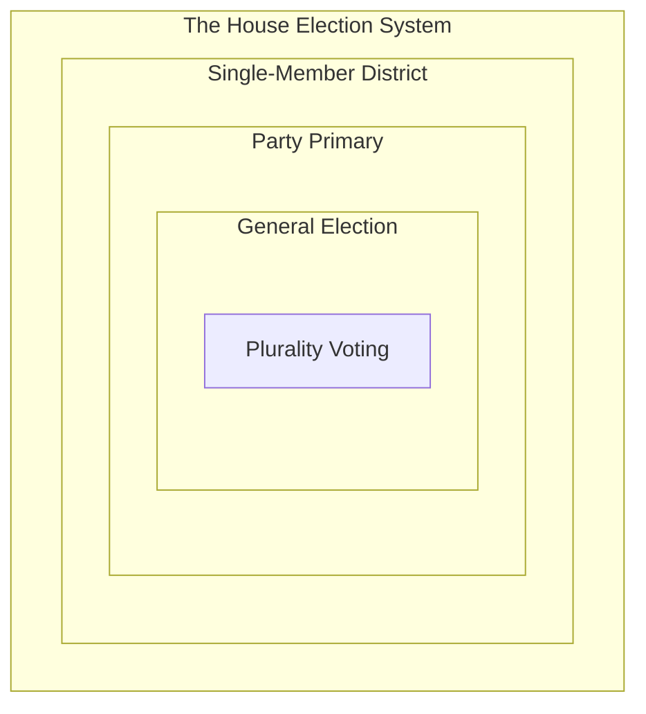
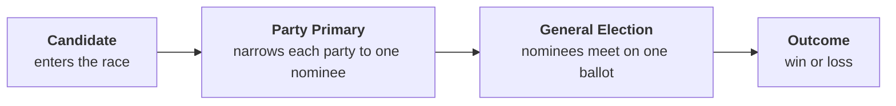
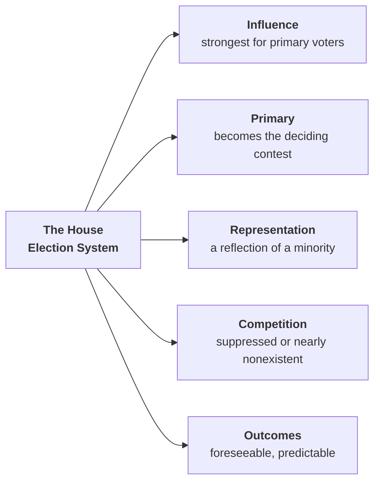

# The Case for STAR and Proportional STAR

## A Position Paper of the Congressional Elections Modernization Act (CEMA)

*Prepared by Albert Ramos for The American Policy Architecture Institute*

---

The House of Representatives is the chamber built to be closest to the people. Its members face the voters every two years. Its seats are divided among the states by population, and each one is filled by direct election from a local community. The design has a purpose: to make the House the most responsive part of the government, the place where people send someone to speak for them. That role shapes the direction of the country. So how the seats are filled matters as much as the role itself — and a chamber meant to track the people fails at its purpose if most of its seats are settled without them.

That is what the current method does. We elect the House through a system of parts. Assembled, they produce a result almost no one would choose on purpose: most congressional elections are decided before they are held.

The system is built from the following basic components. It isn't limited to them, but they give it its overall structure and shape:

- The **single-member district** is the administrative boundary of representation.
- The **primary** is an internal party contest to decide on a nominee.
- The **general** is the deciding contest to choose a representative.
- **Plurality voting** is the vote-counting method that decides the winner.

None of these looks like a problem on its own. The trouble is the arrangement.

Take the ordinary case an American voter knows: two parties, each sending one nominee to the general election. Put the components together, and each one pushes toward the same result:

- Each nominee was picked in a **primary** — a separate, earlier election that draws only a small, unrepresentative share of voters. The two names on the November ballot were set by the few who turned out.
- The **single-member district** elects only one member. Only one of the two nominees can win, and the other side's votes seat no one.
- Most districts **lean reliably toward one party**, so the general election's result is known before it is held. The contest that actually decided the seat was the low-turnout primary — the one election almost no one treated as the main event.

The parts compound. Each is modest alone. Together they hand the real choice to the fewest voters and settle the seat before most people have a say.

This is what a non-competitive election is. Not a race that happens to be a blowout, but a seat whose result is settled by structure before any ballot is cast. Most House seats are like this. And it changes what a vote is. A ballot in a settled seat still gets counted — added to a tally, reported in a total. But it does not influence the outcome, because the outcome was never in doubt. Being counted and having influence are not the same thing. The system we have delivers the first and withholds the second.

That gap is the problem, because influence is the reason people vote: not merely to be recorded as present, but to influence the result in some measurable way. While being present is important — civic rituals have a value all their own — going through the motions of voting without seeing a connection between a vote and its outcome is a recipe for eventual disillusionment.

CEMA recognizes this gap between civic ritual and civic influence and sets out to close it: not just to count votes, but to make votes count.

---

## Making Votes Count Means Proportional Representation

To make a vote count is to give it a pathway to influence — a way for a voter's support to register in who actually holds office. Under winner-take-all single-member districts, that pathway is narrow by construction. One seat is available, one candidate takes it, and everyone who preferred someone else is represented by a person they voted against. In a closely divided district the losing side might be just under half the electorate, holding no representation at all. In a lopsided district the losing side has no live contest to begin with. Either way, the structure caps how many voters can come away with a representative of their choosing at a single district's worth of plurality winner.

Proportional representation removes that cap. When a district elects several members rather than one, the seats can be distributed in proportion to how voters actually divided — so a bloc that makes up a third of a district elects roughly a third of its delegation, rather than being shut out by a bare majority. The pathway to influence opens to far more of the electorate at once. This is the prize. It is the most valuable thing CEMA does, because it is the change that most directly converts votes into representation: more voters, in more places, come away from the election with someone in the chamber they chose.

Proportional representation is not a new aspiration in American reform, and CEMA is not the first proposal to pursue it. But proportional representation has prerequisites, and a proposal that wants the prize has to supply them. It needs **magnitude**: districts large enough to divide, which means more seats in the House and multi-member districts to hold them — a one-seat or two-seat district has too little to apportion for proportionality to mean anything. And it needs a **counting method** equal to the conditions that magnitude creates: many candidates on a single ballot, no primary to thin them, and a tabulation that turns scattered support into proportional seats without discarding the voters who provided it. Get the magnitude without the right counting method and the design fails at the count. CEMA supplies both. The rest of this paper is about the second prerequisite — why the counting method is not a free-standing preference but a structural requirement of the prize, and why one method meets that requirement and the leading alternative cannot.

---

## What STAR and Proportional STAR Do

STAR stands for Score Then Automatic Runoff, and the name is the method. A voter scores each candidate from zero to five stars. In the first round, the scores are totaled and the two highest-scoring candidates advance. In the second round — the automatic runoff — each ballot counts as a single vote for whichever finalist the voter scored higher, and the candidate preferred on more ballots wins.

The two rounds discipline each other. The scoring round measures the breadth and intensity of support across the whole field, so a candidate cannot win on a narrow, intense faction alone. The runoff round confirms that the winner is the candidate more voters actually prefer once the choice narrows to two, so a candidate cannot win merely by being inoffensive to everyone and the first choice of no one. A pure score election can elect the blandly acceptable; a pure ranked elimination can discard the broadly preferred. STAR uses each round to cover the other's weakness.

One feature of that design carries most of the weight in the sections that follow: **the automatic runoff is a majority check built directly into the general election.** A traditional primary-then-general system uses the primary to thin a field and the general to produce a majority between the survivors. STAR performs the second job inside the general election itself — the runoff guarantees the final winner is majority-preferred between the top two. That is the structural reason STAR can be trusted without a primary standing behind it.

Proportional STAR extends the identical ballot to multi-seat districts. Voters score candidates from zero to five exactly as they do in a single-seat race; nothing about the voter's task changes. Seats are then filled in rounds using the Allocated Score tabulation: the highest-scoring candidate is elected, the ballots that supported that winner have their weight proportionally reduced — spent, in effect, on the seat just filled — and the next seat is awarded on the remaining weight, repeating until the district is full. The result is a delegation whose composition tracks the distribution of voter support, produced without party lists, without closed slates, and without asking the voter to do anything but rate the individual people on the ballot. A voter who wants to know which member represents them has a clean answer: the one you gave five stars to. Proportional STAR is the method; Allocated Score is the tabulation that delivers its proportional result.

Two things about the design are worth stating plainly. The method is American in origin, developed by the Equal Vote Coalition rather than adapted from a parliamentary tradition built to solve a different country's problems. And the ballot is the same whether a district elects one member or several — one ballot action for every congressional contest a voter will ever face.

---

## What the Counting Method Has to Do

The prize and its prerequisites impose requirements on the counting rule. They are not abstract desiderata; they are the conditions the method has to survive to deliver proportional representation on a single general-election ballot.

**It has to tolerate the full field.** When the state no longer runs a primary to narrow the candidates, every qualified candidate appears together on the November ballot. There is good reason to want that: a primary is a low-turnout contest, decided by a small and unrepresentative slice of the electorate, that nonetheless sets the field for everyone in November; it shuts out independents and the unaffiliated from the consequential first round; it makes voters turn out twice. Putting the full field before the full electorate at the moment turnout is highest is the affirmative gain. But it also means the counting method must handle a crowded ballot without breaking — and as the next section shows, not every method can.

**It has to find a majority on its own.** With no primary to produce a final pairing, the general election has to do that work itself. STAR's automatic runoff does exactly this: it resolves to a majority preference between the top two inside the single election. A method that cannot produce a majority winner without an upstream contest has not actually removed the upstream contest; it has only hidden its dependence on it.

**It must not discard the voters it admits.** This is the requirement that the whole opening built toward. A method whose purpose is to make votes count cannot be a method that, in normal operation, stops counting votes that were lawfully cast. A ballot that is accepted and then dropped from the tally before the result is decided is a vote that lost its pathway to influence midway through — the precise failure CEMA exists to close. This requirement is not a preference among acceptable options. It is a line. And it is the line on which the leading reform alternative fails.

---

## Why Ranked Methods Cannot Meet the Requirement

The leading reform proposal for proportional representation, the Fair Representation Act, builds on ranked choice voting — voters rank candidates in order, and the count proceeds by eliminating the lowest and transferring their ballots until seats are filled. Ranked choice is the established reform method, with real adoption and a long international record, and the movement behind it is serious and well-organized. CEMA declines it anyway, and the reason is not a close-run comparison of virtues. It is a single defect that the requirement above rules out absolutely.

### Ballot Exhaustion Is the Line

In a ranked-elimination count, a ballot stays in the tally only as long as one of the candidates it ranked is still standing. When the last candidate a voter ranked is eliminated, the ballot has nowhere left to transfer. It is set aside. It takes no part in the rounds that follow, including the round that decides the seat. The voter showed up, marked the ballot correctly, and still had it removed from the count before the election was over. This is ballot exhaustion, and it is the reason CEMA will not build on ranked choice voting.

The distinction that matters is between a quality defect and a legitimacy defect. A quality defect means the method sometimes produces a worse outcome — the wrong winner, an incoherent result. A legitimacy defect means the method, operating exactly as designed, denies a lawful voter their say. Exhaustion is the second kind. It is not a miscount or a malfunction; it is the counting rule working as intended, discarding ballots as a routine step. A method whose normal operation throws away lawfully cast votes fails CEMA's central requirement at the threshold — before any question of outcome quality is even reached. If ranked choice voting had no other flaw, this one alone would disqualify it.

It is tempting to soften exhaustion into voluntary abstention: the voter chose to rank only a few candidates, so the voter chose to drop out of the later rounds. The framing does not survive contact with how the discard actually happens. Abstention is a choice the voter makes; exhaustion is an action the method takes. The two coincide only if the voter both understood that ranking fewer candidates risked their ballot falling out of the count and intended that outcome — and neither holds in practice. Voters are not told that an incomplete ranking may forfeit their vote in a later round, and much of the truncation is not a considered decision at all but the product of a long, demanding ballot. A consequence the voter did not know they were courting and would not have chosen is not an abstention. It is a discard the system performed and labeled a choice.

The jurisdictions that run ranked elections have effectively conceded that exhaustion is a real and serious problem, because they have spent considerable effort trying to suppress it. Those efforts are worth reading closely, because they reveal a trap rather than a fix:

- **Optional ranking** — letting voters rank as many or as few candidates as they like — produces exhaustion directly. Every truncated ballot is a candidate for the discard pile once its ranked candidates are gone.
- **Caps on the number of rankings** — San Francisco long allowed only three, New York City five — force exhaustion structurally. A voter who is permitted to rank only three of fifteen candidates will have an exhausted ballot whenever all three are eliminated, no matter how engaged that voter was.
- **Compulsory full ranking** — Australia's approach — suppresses exhaustion by forcing voters to rank every candidate, on pain of having the ballot rejected as invalid. This does not save the ballots; it relocates the loss. Ballots that would have exhausted at the count are instead spoiled at submission, and the mandate generates its own large volume of invalid ballots and reflexive down-the-line marking.

This is the trap. To eliminate exhaustion, a ranked-elimination method has two doors. Through the first — optional ranking — ballots exhaust during the count. Through the second — compulsory ranking — ballots are spoiled at submission instead, which discards lawful votes at a different stage rather than saving them. The caps are a dial between the two, tuning how much is lost and where. There is no door that discards nothing. The defect is not in any particular implementation; it is in the elimination engine itself, which can only ever choose which lawful ballots to set aside, not whether to set any aside at all.

The numbers confirm that the bolt-ons do not cure the defect. In San Francisco's November 2010 election for the District 10 seat on the Board of Supervisors — twenty-one candidates, a three-ranking cap — the count began with 17,808 continuing ballots and ended, twenty rounds later, with 9,503 of them exhausted. The winner took the seat with 4,321 votes: fewer than half the number of ballots that had been discarded along the way, and about a fifth of all ballots cast. That is not a marginal leak. It is a majority of the starting ballots falling out of the count before the result, with the winner seated on less support than the discard pile represented.

The loss is not borne evenly. Research on ranked ballots finds that exhaustion and ballot-marking errors fall most heavily on the voters already most likely to be underrepresented — voters of color, lower-income voters, voters with less formal education, voters in non-English-dominant households, and older voters. The finding is directionally consistent across studies, though it rests on ecological inference and is contested at the edges; the honest statement is that the documented pattern points one way and that the pattern concerns exactly the populations electoral reform is meant to serve. The comparative point survives the methodological dispute intact: a method with no exhaustion mechanism never raises the question of who gets exhausted.

STAR raises none of this, because it has no elimination sequence to exhaust a ballot and no forced ordering to spoil one. A voter scores the candidates they have opinions about and leaves the rest at zero, and every scored ballot stays active through both the scoring round and the runoff. There is nothing to bolt on, because there is nothing to suppress. Zero exhaustion, by structure — not by a well-tuned parameter that the next jurisdiction might set differently.

A fair-minded reading should place ranked choice in its time. The method descends from work in the 1850s and 1870s, developed before modern social choice theory and before the statistical tools — voter-satisfaction efficiency, regret modeling, large-scale simulation — that let designers see failure modes its inventors had no way to anticipate. It was a genuine advance for its era and remains workable in many settings. The objection here is not that its designers erred, but that a nineteenth-century mechanism carries a defect that the jurisdictions using it have spent real effort trying to patch, and that a method built with the later tools does not carry at all.

### The Lesser Failures

Exhaustion is sufficient on its own. But the ranked-elimination engine carries further defects, and they are worth naming after the disqualifying one — quality defects that compound the case rather than make it.

**Field-size intolerance.** A ranked ballot asks the voter to place candidates in strict order. With three or four candidates this is manageable. With fifteen or twenty — the field a general election attracts once no primary has thinned it — it becomes a real imposition, and the ballot swells into a grid of candidates against rank positions whose every added column multiplies the ways a ballot can be spoiled. The method's failure modes intensify with the field as well: more candidates and more elimination rounds mean more opportunities for the order-of-elimination perturbations that produce ranked voting's pathologies. Ranked counting performs tolerably only when something has already pruned the field — which is why ranked elections at scale are paired with heavy pre-election winnowing. That dependency is the same trap exhaustion revealed, seen from the side of usability: the method needs the primary CEMA removed.

**Center squeeze.** A candidate a majority would prefer over every rival can be eliminated early for lack of first-choice votes, handing the seat to someone the majority likes less. The method produces the wrong winner — not by a close count, but as a structural consequence of the elimination order.

**Non-monotonicity.** The count can run backwards: ranking a candidate higher can cause them to lose, and ranking them lower can cause them to win. A method that can punish a candidate for gaining support has loosened its claim to be tracking support at all.

These are real, and they are reasons. But they are quality defects — the method sometimes chooses badly. Exhaustion is the legitimacy defect — the method discards lawful voters as a matter of course. The order matters: a comparison that lists all four side by side as equal marks has committed the central error of the reform debate, treating a discarded ballot and a slightly suboptimal winner as the same weight of failure. They are not. The line is exhaustion. The rest is the case piling on.

---

## Compared to What? The Failures You Would Choose

No voting method is flawless. The Gibbard-Satterthwaite theorem establishes that every deterministic, non-dictatorial method of choosing among three or more candidates can be manipulated by strategic voters under some circumstances. There is no method that is honest-proof, spoiler-proof, and paradox-proof at once, and any advocate who implies otherwise about their preferred method is selling something. So the serious question is never "is this method perfect" — none is — but a comparative one: of the failures no method can fully escape, which can a democracy best live with?

Scored methods have a characteristic weakness, and it should be stated as plainly as the ranked engine's. A pure score election — where the highest total simply wins — can reward strategic compression: a voter who gives five stars to their favorite and zero to everyone else exerts more leverage than one who scores honestly across the field, and in its naive form a pure score count can elect the broadly inoffensive candidate over the one voters genuinely prefer, because nothing in the method forces a final majority test. This is the real critique of scoring, and a method that ignored it would be selling something.

STAR does not ignore it. The automatic runoff is the answer: after the scoring round, the two highest-scoring candidates meet in a head-to-head that resolves to majority preference, so a candidate cannot win on inflated breadth alone, and strategic compression cannot break the result — even when many voters min-max, the runoff still recovers which of the two finalists each voter preferred. The runoff is a patch on scoring's weakness. The decisive fact is *where* the patch sits: it operates at the counting level. STAR corrects the fundamental layer — how the count works — and leaves the voter's ballot exactly as simple as it was. The fix is structural, so it holds for every election regardless of how any individual fills out the ballot, and it asks nothing additional of the voter.

Set that against how ranked methods patch their weakness, and the asymmetry is the whole argument:

- **STAR patches scoring at the counting level.** The fundamental layer is corrected, the ballot stays simple, the voter's task is unchanged, and the fix holds universally because it is structural. No added burden on the voter, and no compensating voter-education campaign required to make it work.
- **Ranked methods patch elimination at the ballot level.** Every mitigation for exhaustion — ranking caps, unlimited ranking, compulsory full ranking — changes what the voter must do with the ballot rather than how the count works. That added burden then requires jurisdictions to spend on voter education, pamphlets and instruction meant to keep ballots alive through as many rounds as possible. And after the patch and the education spend, the engine still discards, because no ballot-level patch can reach a counting-level defect.

One family fixed its problem at the root and kept the ballot easy. The other left the problem at the root, pushed the cost onto the ballot and onto the voter, and then had to spend again to manage the cost it created — without ever closing the original defect. That STAR needed a patch is not a concession that weakens the case; it is evidence of the right instinct. The flaw was corrected at the layer where it lived.

The runoff does carry one honest residual, and it is worth naming as itself rather than dressed in a borrowed criterion. Because the runoff turns on which of two finalists a voter scored higher, a voter who understands the field has a strategic incentive to *bury* an acceptable rival — to score that rival lower than their true opinion — to keep them out of the final pairing. This is burial, a cardinal-terms incentive that belongs to the scoring ballot, and it is the genuine strategic vulnerability STAR's structure introduces. Its practical bite is limited: burial requires accurate knowledge of which rival actually threatens one's favorite, it backfires when the buried candidate would have beaten someone worse, and the pivotal-voter modeling of Wolk, Quinn, and Ogren finds that under STAR's two rounds the dishonest strategies — favorite betrayal, burial, and bullet voting alike — are strongly disincentivized, with the residual incentive small and confined to mild honest inflation that preserves a voter's true preference order. The incentive is real and is treated more fully in the accompanying discussion of common objections; the point here is that it is a known, bounded, cardinal-level residual — not a discarded ballot, and not the wrong winner installed by the count.

### The Demonstration: Alaska, on the Actual Ballots

The weight of these failures can be read off a real federal election whose every ballot is public.

In the August 2022 special election for Alaska's lone U.S. House seat, three candidates ran — Mary Peltola, Nick Begich, and Sarah Palin — under the single-winner form of ranked choice voting. Begich received the fewest first-choice votes and was eliminated first. His ballots transferred, and Peltola defeated Palin. But the full Cast Vote Record told a different story than the result. In an analysis published in *The Mathematics Enthusiast*, Jeanne Clelland established that Begich was the Condorcet winner: head-to-head, the ballots show he would have beaten both Palin and Peltola. The candidate a majority preferred over each rival was eliminated first, for want of first-place votes — a center squeeze. And of the roughly fifty-four thousand ballots that ranked Begich first, more than eleven thousand exhausted when he was eliminated, dropping out of the count. One election, both grave failures at once: the majority-preferred candidate eliminated, and eleven thousand cast ballots discarded.

Holding the same real ballots fixed, Clelland asked how the election would have resolved under STAR. Begich, the Condorcet winner, would almost certainly have won — because the scoring round registers the broad second-choice support the elimination engine threw away, and the runoff confirms the majority preference between the top two. Because Palin was the Condorcet loser, STAR's runoff structurally forecloses her under any plausible scoring. The method catches precisely what the elimination engine missed.

Two cautions keep this honest. The STAR result is a counterfactual reconstructed from ranked ballots under stated, conservative assumptions about how voters would assign stars; Clelland calls it "likely — but not at all certain," and the same restraint is owed here. The underlying preference data is not in dispute — her tabulation independently matches the published cast-vote analysis of Graham-Squire and McCune. And Condorcet failures like Alaska's are rare: of 182 American RCV elections between 2004 and 2022, only two failed to elect the Condorcet winner.

Rarity, though, is the scorecard's argument, not an answer to this one. Weighing failures by severity rather than counting them by frequency is the whole point: a rare catastrophe and a common nuisance are not interchangeable. The other of those two Condorcet failures was the 2009 Burlington mayoral election — after which the city repealed ranked choice voting outright. Alaska's became a national exhibit against RCV and helped fuel a wave of state-level bans. And the rarity cuts against its defenders when the method goes national. A base rate that produced two notable disasters across two decades of scattered, mostly local use does not stay small when ranked elections run in every congressional district every cycle, indefinitely. A nonzero failure rate applied to hundreds of federal contests in perpetuity does not yield two failures in twenty years; it yields a steady recurrence, each one a concrete, nameable contest in which the candidate most voters preferred lost and lawful ballots were discarded. These do not average into a reassuring aggregate. Each lands where it happens, on the voters who lived it, and each chips at confidence in the one institution that can least afford its legitimacy questioned. STAR forecloses both failures structurally: it cannot exhaust a ballot, and it cannot seat the Condorcet loser.

### Two Objections, Answered

Two standard objections to scored voting dissolve once the comparison is framed this way.

The first is the *ordinal-supremacy* argument: that ranked ballots are epistemically cleaner because ordering candidates is something voters can do honestly, while scoring invites strategic exaggeration. Gibbard-Satterthwaite is the reply. Strategic incentive is not peculiar to scored ballots; it is a feature of every method that aggregates more than two options, ranked methods included — manipulable by burial, compromising, and a documented catalog of other maneuvers. The honest framing is not "scored methods are manipulable and ranked methods are not," which is false, but "every method is manipulable, so the question is which produces good outcomes under realistic, partly-strategic voting." Held to that even standard, the argument does not distinguish the families.

The second is the worry that voters will not use the full scale — that scoring collapses toward a single mark and forfeits its advantage over a one-choice ballot. That is the strategic-compression weakness addressed above: real for a pure score count, and answered by STAR's runoff, which recovers majority preference between the top two whether or not voters spread their scores. It does not distinguish the families either, because it is not a weakness STAR leaves standing.

---

## The Ballot Americans Already Know How to Fill Out

A voting method's first duty is not to satisfy theorists. It is to be usable — correctly, confidently, without special instruction — by every eligible voter who walks into a polling place, including the ones who did not prepare, do not follow politics closely, and will give the ballot ninety seconds. A method that performs beautifully in a textbook and trips up real voters at the margin has failed the test that counts. On that test STAR has an advantage no other reform method can claim: its ballot asks voters to do something tens of millions of them already do, fluently, every week.

Americans rate things. They give restaurants and drivers and products a score out of five before they have finished their coffee. Amazon, Uber, Google, Letterboxd, Yelp, the card at the bottom of a receipt — the zero-to-five rating is among the most widely practiced quantitative judgments in American life, performed across every level of education and political engagement, without anyone needing to explain what three stars means relative to five. The task a STAR ballot asks for is the most rehearsed evaluative act in modern life, moved onto the ballot.

Ask the comparison the other way. When did a company last ask you to rank its services in strict order — to declare the coffee your third preference, the wifi your first, the seating your second, no ties permitted? It does not happen, because strict ordinal ranking of more than a handful of items is genuinely demanding, and businesses that depend on honest feedback from ordinary people do not ask for it. They ask for ratings. The reform movement's ranked methods ask voters, on the highest-stakes ballot they will ever cast, to perform an evaluative act no consumer institution has judged worth requesting from the same people.

This is the same property the field-size argument turned on. The very thing that lets the STAR ballot survive a crowded, unwinnowed field — that the voter scores each candidate independently and may leave any unscored, rather than producing a complete strict ordering — is the thing that makes the ballot familiar and low-error. Independence of judgment is what makes rating easy and what makes it scale; the two virtues are one. And the stakes are not evenly distributed. The ballot-marking errors and incomplete rankings that ranked ballots produce fall most heavily on the voters already most likely to be underrepresented — older voters, voters with less formal education, voters in non-English-dominant households, voters with disabilities. A ballot that is harder to complete correctly filters hardest on the already-marginalized. Choosing the more usable ballot is not a matter of convenience but of which voters' intentions survive the act of voting.

The objection that scored ballots are too cognitively demanding has the matter backwards, and the record shows it. The Independent Party of Oregon used scored voting in a 2020 primary open to more than a million registered members. The Python Software Foundation elects its Steering Council by a STAR-derived method. In binding elections the predicted usability collapse does not occur, because the task — rate these people zero to five — is one voters already know. The cognitive-burden objection imagines voters meeting an alien instrument. They are meeting the most familiar evaluative gesture in their daily lives, printed on a ballot.

---

## Match the Method to the Magnitude

Single-winner STAR and Proportional STAR are the same ballot answering two different structural questions. Where a district elects one member, the question is which single candidate is most preferred, and the scoring round plus automatic runoff answers it. Where a district elects several, the question is how to compose a delegation that mirrors the district, and Allocated Score answers that — electing the strongest candidate, spending the ballots that elected them, and repeating on the remaining weight until the seats are full. The voter's experience is continuous from a one-seat race to a seven-seat one. Only the count behind the curtain changes.

This answers the objection that single transferable vote — the ranked multi-winner method the Fair Representation Act would use — is the more proven or more proportional path. It is not more proportional in any way that survives scrutiny: at equal district magnitude, Proportional STAR and STV produce comparably proportional delegations, because the magnitude is doing that work, not the counting rule. What differs is everything the earlier sections weighed. STV is the multi-winner form of the same ranked-elimination engine, and it carries the same family of liabilities — the demanding ordinal ballot that worsens as the field grows, the ballot exhaustion as preferences run out across elimination rounds, the elimination-order sensitivities — now operating across several seats at once. Proportional STAR delivers the proportional result on the identical zero-to-five ballot, with no exhaustion and no ranking burden, and it produces that result through individuals rather than party lists: a voter is represented by the specific people they rated highly, not by a slate negotiated above their head. The reasonable question — "which of these is my representative?" — has a direct answer: the one you gave five stars to.

The strongest evidence is not theoretical, and it comes from a body that had every reason to prefer the ranked alternative. The Los Angeles chapter of the Democratic Socialists of America ran its internal elections under single transferable vote and then deliberately moved to Proportional STAR — finding that it delivered the proportional representation they valued while dropping what they did not want, the polarizing elimination rounds and the ranked ballot's friction, and preserving the incentive for candidates to seek broad consensus over narrow factional intensity. A constituency predisposed toward the proportional-ranked tradition examined both methods in real binding elections and chose the scored one on the merits. When the people most inclined to favor the ranked method switch away from it after using both, the comparison has been made by the right judges.

---

## Conclusion

CEMA exists to make votes count — to give every ballot a pathway to influence the result, in a chamber built to be closest to the people and a system that currently settles most of its seats before the voters arrive. The change that most directly delivers that is proportional representation: more voters, in more places, coming away from the election with someone they chose. Proportional representation has prerequisites — magnitude, and a counting method equal to the conditions magnitude creates — and the counting method is where the design succeeds or fails.

That method must tolerate the full field, find a majority on its own, and discard no voter it admits. The last is a line, not a preference, and it is where ranked choice voting fails: ballot exhaustion drops lawfully cast votes from the count as a routine step, and every attempt to suppress it only moves the discard to a different stage. A method whose purpose is to make votes count cannot be built on an engine that stops counting votes mid-election. STAR meets the requirement that ranked methods cannot: it finds a majority through the built-in runoff, tolerates a full field through the scored ballot, and exhausts no one — and in multi-seat districts, Proportional STAR delivers proportional representation through the individuals a voter actually rated, on a ballot Americans already know how to fill out.

These are not separate selling points standing in a row. They are what a single requirement looks like when it is met: a counting method equal to the prize. Proportional representation is the most valuable thing CEMA does. STAR is what lets it succeed.

---

## Works Cited

Clelland, Jeanne N. "Ranked Choice Voting and Condorcet Failure in the Alaska 2022 Special Election: How Might Other Voting Systems Compare?" *The Mathematics Enthusiast* 23, no. 3 (2026): 185-196.

Gibbard, Allan. "Manipulation of Voting Schemes: A General Result." *Econometrica* 41, no. 4 (1973): 587-601.

Graham-Squire, Adam, and David McCune. "An Examination of Ranked-Choice Voting in the United States, 2004-2022." *Representation* (2023). https://doi.org/10.1080/00344893.2023.2221689.

San Francisco Department of Elections. "Ranked-Choice Voting Results: Board of Supervisors, District 10." *November 2, 2010 Election Results Summary*. 2010. https://sfelections.org/results/20101102/data/d10.html.

Satterthwaite, Mark A. "Strategy-Proofness and Arrow's Conditions: Existence and Correspondence Theorems for Voting Procedures and Social Welfare Functions." *Journal of Economic Theory* 10, no. 2 (1975): 187-217.

Wolk, Sara, Jameson Quinn, and Mark Ogren. "STAR Voting, Equality of Voice, and Voter Satisfaction: Considerations and Simulations." *Constitutional Political Economy* 34 (2023): 301-325.

---

<!--
## Revision History

**Revision 6.4h** (Current)
- Removed the "DRAFT — for review" status notice from the header in preparation for publication. No content change; the header now matches the standard Supporting Document form (title, typed subtitle, author byline).

**Revision 6.4g**
- Completed the Works Cited: added the San Francisco Department of Elections official ranked-choice report for Board of Supervisors District 10 (November 2, 2010), the source for the District 10 exhaustion figures used in the body (17,808 continuing; 9,503 exhausted; winner seated on 4,321), which had been cited in prose without a bibliography entry. The official SF Elections report is cited directly, not the opponent (FGA) echo.

**Revision 6.4f**
- Established the document's Revision History and populated it with the full verified record: imported the 5.9–6.4 chain from the published baseline and the 6.4a/6.4b rebuild changelog from the origination thread; corrected the baseline attribution (the rebuild belongs to 6.4a/6.4b, not to the 6.4 alignment entry); added the GitHub download link per DPS §1.3 and §1.9. Supersedes the provisional Revision History scaffolded at 6.4e.

**Revision 6.4d**
- Converted all proposal self-references in the body from "the Act" to "CEMA" throughout, applying the DPS §1.7 provision that suspends the "the Act" shorthand in Position Papers engaging alternatives. Rationale: with the Fair Representation Act named in the text, abstracting CEMA to "the Act" created an unintended branding asymmetry, and naming CEMA throughout lets the document credit the proposal by name. Eleven instances across ten lines; the Fair Representation Act references and the common-noun "act of voting" were left intact.

**Revision 6.4c**
- Merged the v7 introduction branch into the trunk. Replaced the prose-only opening with the diagrammed opening: a four-component lead-in (single-member district, primary, general, plurality voting), three Mermaid diagrams (nested system, candidate-to-outcome pipeline, consequence constellation), the "the trouble is the arrangement" turn promoted to its own line, and the two-paragraph closing (civic-ritual diagnostic, then CEMA's response).

**Revision 6.4b**
- Later-no-harm concession removed entirely; replaced with the counting-level-vs-ballot-level patch asymmetry: scoring's characteristic weakness (strategic compression, consensus-over-preferred in pure score) conceded honestly; STAR's automatic runoff identified as a counting-level patch that corrects the fundamental layer while leaving the ballot simple; contrasted against ranked methods' ballot-level patches (caps, unlimited ranking, compulsory ranking) that burden the voter, require compensating voter-education campaigns, and still do not reach the counting-level defect
- Burial named in cardinal terms as STAR's genuine strategic residual — the incentive to score an acceptable rival lower than honestly to keep them out of the runoff — bounded by the Wolk-Quinn-Ogren finding, explicitly not framed as a later-no-harm failure, with fuller treatment pointed to the "Addressing Questions and Concerns" document
- Duplicate strategic-compression paragraph in "Two Objections, Answered" collapsed to a short pointer (content now lives in the "Compared to What?" section)
- TTS PDF and working copy regenerated from the corrected trunk; verified: no "CEMA" tokens, no "later-no-harm" strings, burial present, ends on copyright line

**Revision 6.4a**
- Complete re-spine: load-bearing thesis changed from "the most valuable structural move the Act makes is ending the state-administered primary" to "the Act exists to make votes count; proportional representation is the prize; STAR is the counting method proportional representation requires"
- Primary-removal demoted from thesis to consequence throughout; now appears as one of three requirements the counting method must satisfy ("tolerate the full field"), not as the Act's most valuable move
- New opening section ("The System We Have"): status-quo-first structure modeled on primer architecture; the House's representative purpose as the standard; the current system as interlocking components that compound; the influence-vs-counting distinction; "not just to count votes, but to make votes count" as the closing pivot
- New section "Making Votes Count Means Proportional Representation": PR stated as the prize and the Act's most valuable contribution; prerequisites (magnitude + counting method) established as the structural frame for the rest of the paper
- New section "What the Counting Method Has to Do": three requirements derived from the prize and its prerequisites — tolerate the full field, find a majority on its own, discard no voter it admits; third requirement explicitly identified as the line on which the leading alternative fails
- Ballot exhaustion promoted from embedded list item to standalone subhead ("Ballot Exhaustion Is the Line") leading the RCV section; framed as a legitimacy defect distinct from quality defects (center squeeze, non-monotonicity); the abstention-vs-disenfranchisement rebuttal written generously; the inescapable-discard dilemma developed (optional ranking exhausts, compulsory ranking spoils, caps tune which — no configuration discards nothing); bolt-ons-as-confession argument (jurisdictional mitigations prove the defect is real and acknowledged); verified SF District 10 figures incorporated (17,808 continuing, 9,503 exhausted, winner seated on 4,321); disparate-impact finding stated in measured facts-on-the-ground register with methodological contest acknowledged; historical placement of RCV in time (1850s–1870s origin, predates modern social choice theory)
- Center squeeze and non-monotonicity demoted to "The Lesser Failures" subsection, explicitly marked as quality defects subordinate to the legitimacy defect
- Old "Architectural Argument" section dissolved; its substantive content (why the counting method is not a free-standing preference) redistributed into "Making Votes Count Means Proportional Representation" and "What the Counting Method Has to Do"
- Old "A note on what the Act does, and does not, do to primaries" section: retained in position but now reads against the new spine (primary-removal as consequence, not thesis)
- Alaska demonstration compressed; cautions retained (counterfactual nature, Clelland's own hedging); rarity-is-the-scorecard's-argument rebuttal kept; nonzero-failure-rate-at-national-scale argument kept
- "The Ballot Americans Already Know How to Fill Out" section: retained with minor tightening; no structural change
- "Match the Method to the Magnitude" section: retained; no structural change
- Conclusion rewritten to close on the new spine: PR is the prize, STAR is what lets it succeed
- Throat-clearing, roadmap paragraphs, self-referential section-number cross-references, and editorializing removed throughout (the "this paper makes a single claim" opener, "the argument runs as follows" roadmap, "here is the center of the case" announcement, "the asymmetry is not subtle" self-grading, and similar)
- Later-no-harm conceded as a flaw STAR fails — this was an error carried forward from the old paper, corrected in 6.4b

**Revision 6.4**
- Aligned with Rev 6.4 of the CEMA legislative text (6.4 alignment sweep). No content change required.
- Rev 6.3 disposition: no content references Title I ballot-access specifics (petition routes, signature thresholds, filing fees) at a level affected by 6.3 changes. Verified clean
- Rev 6.4 disposition: no content references Title II party recognition structure, Title V compensation specifics, or Section 704 effective-date tiers. Verified clean

**Revision 6.2**
- Full-Field framing alignment to the CEMA Rev 6.2 legislative text (affirmative full-field standard plus the split of the primary prohibition into independent funding and enforcement bars). Filename advanced from 6-0 to 6-2; the changes below establish the 6.2 baseline and so carry no letter suffix
- **"Abolish" retired for the primary (3 sites):** "abolishes the primary" -> "ends the state-administered primary" (Proportional RCV fork); "abolishes the winnowing step" -> "removes the winnowing step" (architectural conclusion); "abolishes that winnowing" -> "removes that winnowing" (paper conclusion). The disclaimer "The Act does not abolish party primaries" is retained deliberately: keeping "abolish" only there sharpens the contrast between what the Act does not do (abolish primaries) and what it does (end the state's administration of them)
- **"Elimination of the primary" reframed toward the affirmative full-field standard:** roadmap "the thing the Act eliminated" -> "the winnowing the Act removed"; note opener "rests on the elimination of the state-administered primary" -> "rests on the end of the state-administered primary"; architectural opener "The Act eliminates the state-administered primary" -> "The Act ends the state-administered primary" (affirmative full-field consequence retained immediately after); "compatible with the elimination of primaries... the elimination of primaries makes necessary" -> "compatible with a general election that carries the full field... the full field makes necessary" (parallel and "makes necessary" cadence preserved); thesis closer "the voting method and the elimination of the primary are two halves of a single coherent decision" -> "the voting method and the move to a single general election carrying the full field are two halves of a single coherent decision" ("two halves of a single coherent decision" preserved); paper conclusion given an affirmative lead ("putting the full field before the full electorate in a single general election, which ends the state-administered primary...")
- **Ranked-counting "elimination" vocabulary preserved intentionally:** all instances describing how ranked methods work (elimination rounds, order-of-elimination, candidates eliminated in IRV, ranked-elimination engine) were left untouched, as they are correct technical vocabulary, not stale primary-prohibition framing
- **Two-bar nod added (1 sentence):** in the existing "A note on what the Act does, and does not, do to primaries," one sentence notes that the Act's restructure ends the state's funding and administration of the nomination contest and declines to enforce any private nomination result as a ballot gate; the existing pointer to the Constitutional Authority Technical Memorandum carries the detail. The architectural argument was deliberately left at the "the winnowing is gone" level; the funding-bar/enforcement-bar mechanism was not imported into it
- **Terminology verified:** "Proportional STAR" throughout (no "STAR-PR" drift); "Allocated Score" used only at the algorithm level
- **DPS 3.8 compliance confirmed:** Supporting Document header (H1 own title, H2 typed relational subtitle, author byline) and footer (copyright line, no attribution line) verified against APAI Document Production Standards Rev 3.8; filename token and revision-history token aligned at 6.2

**Revision 6.1**
- No changes required. Rev 6.1 removed the Voting Rights Act Section 2 vote-dilution carve-out from the legislative text; this document does not reference that mechanism (grep-verified clean) and required no content change

**Revision 6.0**
- Aligned with Rev 6.0 of the CEMA legislative text
- **DPS 3.4 compliance:** Header corrected to Supporting Documents format (H1 = document title, H2 = typed relational subtitle, author byline); copyright line added to footer

**Revision 5.9**
- Initial publication
- Classified as Position Paper per APAI Document Production Standards Rev 3.2

-->

*Revision history available in the raw file.*

> 📥 [Download this document](https://github.com/albertintech/apai/blob/main/docs/congress/cmf/cema/the-case-for-star-and-proportional-star.md) (opens on GitHub -- click the ⬇ download button)

---

*© 2026 Albert Ramos | American Policy Architecture Institute*
